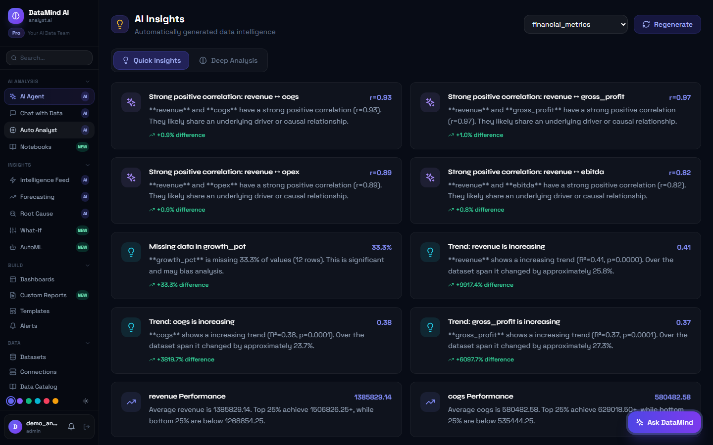
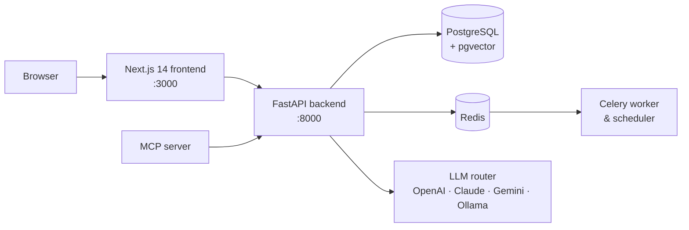

# DataMind AI: Autonomous AI Data Analyst

**An AI-powered analytics platform that works like a data team. Upload a dataset, ask questions in plain English, and get statistical insights, forecasts, dashboards, and reports automatically.**




---

## Features

### AI analysis
- **AI Agent:** give it a goal ("find anomalies in Q4 sales and explain them") and it plans and runs the analysis on its own
- **Chat with your data:** conversational Q&A over any uploaded dataset
- **Natural language to SQL:** turns plain-English questions into SQL queries
- **Auto insights:** correlations, trends, missing-data warnings, and performance summaries with statistical backing (R², p-values)
- **Notebooks:** run Python analysis in a sandboxed environment

### Advanced analytics
- **Forecasting** of future values from historical data
- **AutoML:** trains and compares machine-learning models automatically
- **Anomaly detection and root-cause analysis** to explain what drove a change
- **What-if scenarios** to test the impact of assumptions
- **Intelligence feed:** proactive monitoring that flags anomalies and opportunities

### Build and share
- Dashboards, custom and scheduled reports, PDF export, and 20+ industry templates
- Alerts, webhooks, email notifications, and shareable links
- Data connections to databases, BigQuery, MongoDB, and S3, plus a data catalog

### Platform
- **Multi-LLM routing** across OpenAI, Anthropic Claude, Google Gemini, and local models via Ollama, with a rule-based fallback when no LLM is configured
- **MCP server** that exposes DataMind as tools for Claude Desktop, Cursor, and other AI agents
- JWT authentication, rate limiting, workspaces, and API keys
- Background jobs with Celery and Redis, and real-time updates over WebSockets

## Architecture



| Layer | Technologies |
|---|---|
| Backend | FastAPI, SQLAlchemy, Alembic, Pydantic, python-jose, SlowAPI |
| Data & ML | pandas, NumPy, scikit-learn, SciPy, statsmodels, sentence-transformers |
| AI | OpenAI, Anthropic, Google Gemini, Ollama, RAG with pgvector |
| Frontend | Next.js 14, TypeScript, Tailwind CSS |
| Infrastructure | PostgreSQL, Redis, Celery, Docker Compose, GitHub Actions CI |

## Getting started

### Option 1: Docker (full stack)

```bash
cp .env.example .env        # add at least one LLM key, e.g. OPENAI_API_KEY
docker compose up --build
```

This starts PostgreSQL, Redis, the API, Celery workers, and the frontend. Open http://localhost:3000.

### Option 2: Run locally

**Requirements:** Python 3.10+, Node.js 18+

```bash
# Backend (http://localhost:8000, API docs at /docs)
cd backend
python -m venv venv
source venv/bin/activate          # Windows: venv\Scripts\activate
pip install -r requirements.txt
cp ../.env.example .env           # optional: add an LLM key
uvicorn main:app --reload --port 8000
```

```bash
# Frontend (http://localhost:3000), in a second terminal
cd frontend
npm install
npm run dev
```

Without `DATABASE_URL`, the backend falls back to a local SQLite database. Without an LLM key, it uses built-in statistical analysis.

Click **"Try Demo"** on the login page for instant access.

## Tests

```bash
cd backend
pytest
```

The GitHub Actions pipeline runs the backend tests, migrations, and a production frontend build on every push and pull request to `main`.

## Project structure

```
backend/
├── main.py            FastAPI entry point
├── routers/           35+ API modules (agent, chat, nl2sql, automl, forecasting, ...)
├── services/          Analysis engines, LLM router, RAG, sandbox, report builder
├── models/            SQLAlchemy models
├── security/          JWT authentication
├── mcp_server.py      Model Context Protocol server
└── tests/             pytest suite
frontend/              Next.js 14 app (dashboards, chat, analytics, reports, ...)
docker-compose.yml     PostgreSQL, Redis, API, Celery, frontend
```

## Author

**Mohammad Albreim**, Data Science & AI
[LinkedIn](https://linkedin.com/in/albreim-ai-ds) · [GitHub](https://github.com/Mo7ammadosama)
